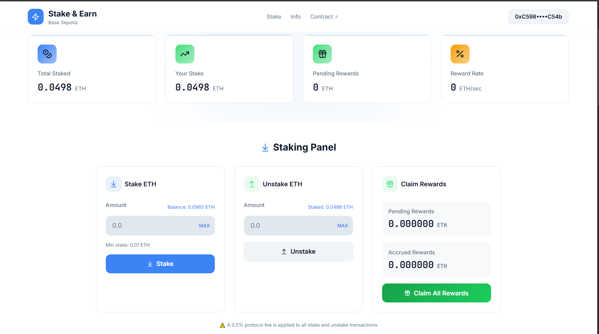
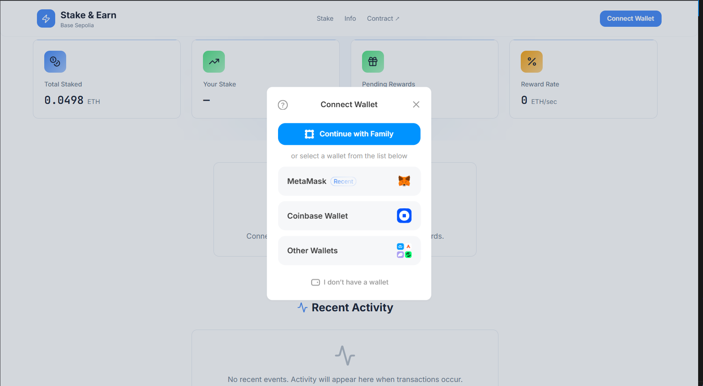
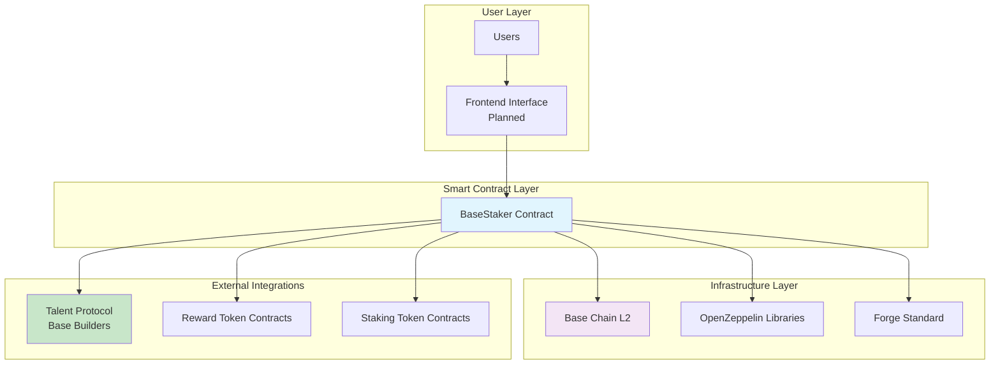
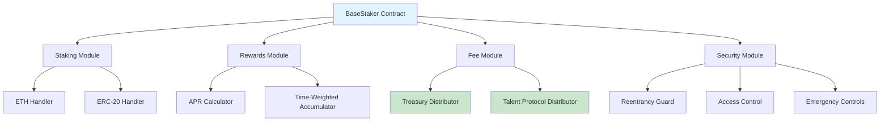
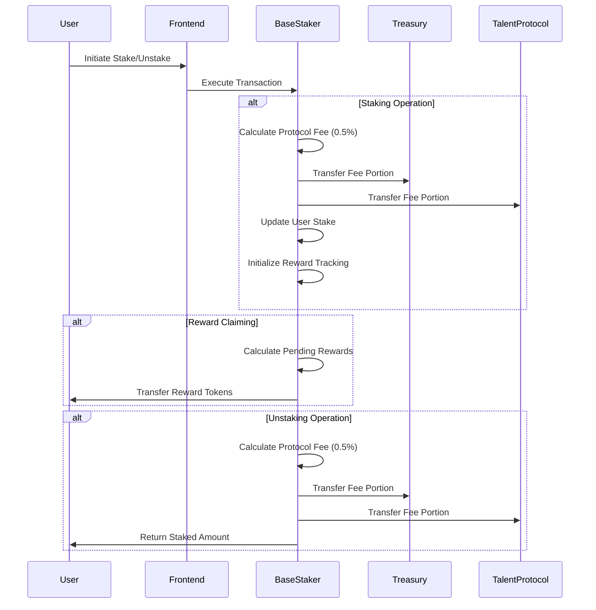

# BaseStaker

[](https://soliditylang.org/)
[](https://getfoundry.sh/)
[](LICENSE)
[](https://base.org/)
[](https://sepolia.basescan.org/address/0xfeEfd505E894eA194Aa6Cf6c0226d9Dce9F41323)
[](https://walletconnect.com/)

A decentralized staking rewards protocol on Base Layer 2 that enables users to stake ETH or ERC-20 tokens to earn custom reward tokens, with protocol fees generating on-chain revenue for ecosystem development through the Talent Protocol Base Builders leaderboard.



## Table of Contents

- [Overview](#overview)
- [Features](#features)
- [Architecture](#architecture)
- [Project Structure](#project-structure)
- [Getting Started](#getting-started)
- [Development](#development)
- [Testing](#testing)
- [Deployment](#deployment)
- [Contributing](#contributing)
- [Roadmap](#roadmap)
- [License](#license)

## Overview

BaseStaker is a comprehensive decentralized finance (DeFi) protocol designed for the Base Layer 2 network. It provides a secure, non-custodial staking mechanism where users can deposit ETH or ERC-20 tokens to earn yield through custom reward tokens. The protocol incorporates a sustainable economic model with protocol fees on staking operations, contributing to ecosystem growth and supporting the Talent Protocol Base Builders leaderboard.

This project serves as a complete solution for DeFi staking, combining smart contract infrastructure with future frontend interfaces to provide users with an intuitive way to participate in decentralized staking.



## Features

### Core Functionality
- **Multi-Asset Staking**: Support for native ETH and any ERC-20 token staking
- **APR-Based Rewards**: Configurable reward rates with predictable yield calculations
- **Time-Weighted Rewards**: Accurate reward accumulation based on staking duration
- **Flexible Reward Tokens**: Support for custom ERC-20 tokens as rewards

### Economic Sustainability
- **Protocol Fees**: 0.5% fee on stake/unstake operations directed to treasury
- **Treasury Management**: Automated fee collection for ecosystem development
- **Talent Protocol Integration**: Revenue contribution to Base Builders leaderboard

### Security & Controls
- **Non-Custodial Design**: Users maintain full control of their assets
- **Reentrancy Protection**: Comprehensive security measures against common attacks
- **Emergency Controls**: Owner-controlled pause and emergency withdrawal capabilities
- **Access Control**: Role-based permissions for administrative functions
- **Input Validation**: Minimum stake thresholds and balance verification

### Developer Experience
- **Foundry Framework**: Modern Ethereum development toolchain
- **Comprehensive Testing**: Full test coverage with gas optimization
- **Modular Architecture**: Clean separation of concerns for maintainability
- **Deployment Scripts**: Automated deployment for testnet and mainnet

## Architecture

### System Architecture



### Contract Architecture



### Data Flow



## Project Structure

```
BaseStaker/
├── contract-solidity/          # Smart contract codebase
│   ├── src/
│   │   └── BaseStaker.sol      # Main staking contract
│   ├── test/
│   │   └── BaseStaker.t.sol    # Contract tests
│   ├── script/
│   │   └── DeployBaseStaker.s.sol # Deployment scripts
│   ├── lib/
│   │   ├── forge-std/          # Foundry testing utilities
│   │   └── openzeppelin-contracts/ # Security libraries
│   ├── deploy-basestaker-mainnet.sh
│   ├── deploy-basestaker-testnet.sh
│   └── foundry.toml            # Foundry configuration
├── frontend/                   # Frontend application (planned)
│   ├── src/
│   ├── public/
│   └── package.json
├── docs/                       # Documentation (planned)
├── .github/                    # GitHub workflows and templates
└── README.md                   # This file
```

## Getting Started

### Prerequisites

- [Foundry](https://getfoundry.sh/) - Ethereum development framework
- [Node.js](https://nodejs.org/) (for future frontend development)
- [Git](https://git-scm.com/) - Version control
- Access to Base chain RPC endpoint

### Installation

1. **Clone the repository:**
   ```bash
   git clone <repository-url>
   cd BaseStaker
   ```

2. **Set up smart contracts:**
   ```bash
   cd contract-solidity
   forge install
   forge build
   ```

3. **Environment configuration:**
   Create a `.env` file in the `contract-solidity` directory:
   ```bash
   # Base Sepolia Testnet
   BASE_SEPOLIA_RPC_URL=https://sepolia.base.org
   BASESCAN_API_KEY=your_basescan_api_key

   # Base Mainnet
   BASE_RPC_URL=https://mainnet.base.org
   ```

## Development

### Smart Contract Development

The smart contracts are located in the `contract-solidity` directory and use the Foundry framework.

**Build the contracts:**
```bash
cd contract-solidity
forge build
```

**Run development server:**
```bash
forge test --watch
```

**Code formatting:**
```bash
forge fmt
```

### Frontend Development (Planned)

The frontend will be built using modern web technologies and will provide:
- User dashboard for staking operations
- Real-time reward tracking
- Transaction history
- Administrative controls

## Testing

### Smart Contract Testing

Run the comprehensive test suite:

```bash
cd contract-solidity
forge test
```

Run tests with detailed gas reporting:

```bash
forge test --gas-report
```

Run specific test files:

```bash
forge test --match-path test/BaseStaker.t.sol
```

Generate coverage report:

```bash
forge coverage
```

### Test Coverage Areas

- Staking functionality (ETH and ERC-20)
- Reward calculation accuracy
- Fee distribution
- Security controls
- Emergency scenarios
- Access control

## Deployment

### Testnet Deployment

Deploy to Base Sepolia testnet:

```bash
cd contract-solidity
./deploy-basestaker-testnet.sh
```

**Current Testnet Address:** `0xfeEfd505E894eA194Aa6Cf6c0226d9Dce9F41323`

### Mainnet Deployment

Deploy to Base mainnet:

```bash
cd contract-solidity
./deploy-basestaker-mainnet.sh
```

### Manual Deployment

For custom deployment parameters:

```bash
forge script script/DeployBaseStaker.s.sol \
  --rpc-url <RPC_URL> \
  --private-key <PRIVATE_KEY> \
  --broadcast \
  --verify \
  --etherscan-api-key <API_KEY>
```

## Contributing

We welcome contributions from developers, security researchers, and community members. This project is designed to be educational and collaborative.

### Ways to Contribute

1. **Code Contributions**
   - Bug fixes and improvements
   - New features and enhancements
   - Test coverage improvements

2. **Documentation**
   - Technical documentation
   - User guides and tutorials
   - API documentation

3. **Testing**
   - Additional test cases
   - Security testing
   - Performance optimization

4. **Research**
   - Economic analysis
   - Security audits
   - Protocol improvements

### Development Process

1. Fork the repository
2. Create a feature branch: `git checkout -b feature/your-feature-name`
3. Make your changes with comprehensive tests
4. Ensure all tests pass: `forge test`
5. Format code: `forge fmt`
6. Submit a pull request with detailed description

### Guidelines

- Follow Solidity style guidelines
- Write comprehensive tests for new functionality
- Update documentation for significant changes
- Maintain backward compatibility where possible
- Consider gas optimization in contract changes

## Roadmap

### Phase 1: Smart Contract Foundation (Current)
- [x] Core staking functionality
- [x] Multi-asset support (ETH + ERC-20)
- [x] APR-based reward system
- [x] Protocol fee implementation
- [x] Comprehensive security measures
- [x] Testnet deployment

### Phase 2: Frontend Development (Q1 2025)
- [ ] User dashboard interface
- [ ] Wallet integration
- [ ] Real-time reward tracking
- [ ] Transaction history
- [ ] Mobile-responsive design

### Phase 3: Advanced Features (Q2 2025)
- [ ] Multi-reward token support
- [ ] Staking pools with different APYs
- [ ] Governance integration
- [ ] Cross-chain functionality
- [ ] Advanced analytics dashboard

### Phase 4: Ecosystem Integration (Q3 2025)
- [ ] DeFi protocol integrations
- [ ] NFT staking rewards
- [ ] Partnership programs
- [ ] Advanced treasury management

### Phase 5: Mainnet Launch & Scaling (Q4 2025)
- [ ] Mainnet deployment
- [ ] Security audit completion
- [ ] Community governance
- [ ] Performance optimization
- [ ] Global marketing campaign

## License

This project is licensed under the MIT License - see the [LICENSE](LICENSE) file for details.

The MIT License allows for broad use of this software while maintaining attribution requirements. This choice enables maximum collaboration and adoption within the blockchain and DeFi communities.