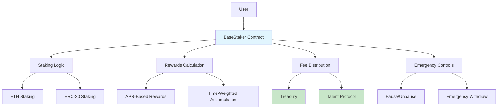
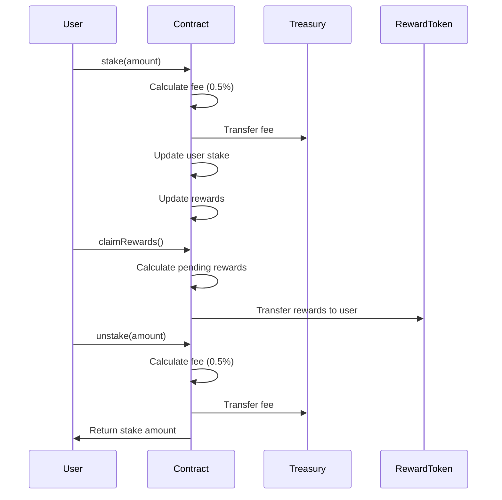

# BaseStaker

[](https://soliditylang.org/)
[](https://getfoundry.sh/)
[](LICENSE)
[](https://base.org/)
[](https://sepolia.basescan.org/address/0xfeEfd505E894eA194Aa6Cf6c0226d9Dce9F41323)

A decentralized staking protocol deployed on Base chain that enables users to stake ETH or ERC-20 tokens to earn yield in custom reward tokens. The protocol implements protocol fees on staking operations to generate sustainable on-chain revenue, contributing to ecosystem development through the Talent Protocol Base Builders leaderboard.

## Table of Contents

- [Overview](#overview)
- [Features](#features)
- [Architecture](#architecture)
- [Installation](#installation)
- [Usage](#usage)
- [Testing](#testing)
- [Security](#security)
- [Contributing](#contributing)
- [License](#license)

## Overview

BaseStaker is a non-custodial staking contract designed for the Base Layer 2 network. It provides a flexible staking mechanism where users can deposit assets and earn rewards calculated based on an APR system. The contract incorporates protocol fees to create economic sustainability while maintaining security through comprehensive access controls and emergency mechanisms.

## Features

- **Multi-Asset Support**: Stake native ETH or any ERC-20 token
- **APR-Based Rewards**: Configurable reward rates for predictable yield
- **Protocol Fees**: 0.5% fee on stake/unstake operations directed to treasury
- **Security Features**: Reentrancy protection, pausable functionality, and safe token transfers
- **Emergency Controls**: Owner-controlled pause and emergency withdrawal capabilities
- **Minimum Stake Threshold**: Prevents dust transactions with 0.01 ETH equivalent minimum

## Architecture

The BaseStaker contract follows a modular architecture with clear separation of concerns:



### System Flow



## Installation

### Prerequisites

- [Foundry](https://getfoundry.sh/) - Ethereum development framework
- Access to Base chain RPC endpoint

### Setup

1. Clone the repository:
   ```bash
   git clone <repository-url>
   cd contract-solidity
   ```

2. Install dependencies:
   ```bash
   forge install
   ```

3. Build the project:
   ```bash
   forge build
   ```

## Usage

### Deployment

#### Environment Setup

Create a `.env` file with the following variables:

```bash
# Base Sepolia Testnet
BASE_SEPOLIA_RPC_URL=https://sepolia.base.org
BASESCAN_API_KEY=your_basescan_api_key

# Base Mainnet
BASE_RPC_URL=https://mainnet.base.org
```

#### Deploy to Testnet (Base Sepolia)

```bash
./deploy-basestaker-testnet.sh
```

**Testnet Contract Address:** `0xfeEfd505E894eA194Aa6Cf6c0226d9Dce9F41323`

#### Deploy to Mainnet (Base)

```bash
./deploy-basestaker-mainnet.sh
```

The deployment configures:
- Treasury address (deployer by default)
- Staking token (ETH by default)
- Reward token (placeholder - update in script)
- Initial reward rate (calculated for 10% APR)

#### Manual Deployment

If you prefer manual deployment:

```bash
forge script script/DeployBaseStaker.s.sol \
  --rpc-url <RPC_URL> \
  --private-key <PRIVATE_KEY> \
  --broadcast \
  --verify \
  --etherscan-api-key <API_KEY>
```

### Staking Operations

#### Stake ETH

```solidity
// Send ETH with the transaction
staker.stake{value: 1 ether}();
```

#### Stake ERC-20 Token

```solidity
// Approve the contract first
token.approve(address(staker), amount);
// Then stake
staker.stake();
```

#### Unstake Tokens

```solidity
staker.unstake(amount);
```

#### Claim Rewards

```solidity
staker.claimRewards();
```

#### Check Pending Rewards

```solidity
uint256 rewards = staker.pendingRewards(userAddress);
```

### Administrative Functions

#### Update Reward Rate

```solidity
staker.setRewardRate(newRate);
```

#### Emergency Controls

```solidity
staker.pause();     // Pause all operations
staker.unpause();   // Resume operations
staker.emergencyWithdraw(tokenAddress, amount); // Emergency withdrawal
```

## Testing

Run the comprehensive test suite:

```bash
forge test
```

Run tests with gas reporting:

```bash
forge test --gas-report
```

Run specific test file:

```bash
forge test --match-path test/BaseStaker.t.sol
```

## Security

The contract implements multiple security measures:

- **Reentrancy Protection**: NonReentrant modifier on all user functions
- **Access Control**: Ownable pattern for administrative functions
- **Emergency Pausing**: Circuit breaker functionality
- **Safe Token Transfers**: SafeERC20 library usage
- **Input Validation**: Minimum stake requirements and balance checks
- **Fee Validation**: Protocol fee calculations with overflow protection

### Security Considerations

- All user-facing functions are protected against reentrancy
- Administrative functions require owner privileges
- Emergency withdrawal is restricted to contract owner
- Protocol fees are immutable once deployed
- Reward calculations use time-weighted accumulation

## Contributing

1. Fork the repository
2. Create a feature branch
3. Make your changes
4. Add tests for new functionality
5. Ensure all tests pass
6. Submit a pull request

## License

This project is licensed under the MIT License - see the [LICENSE](LICENSE) file for details.
